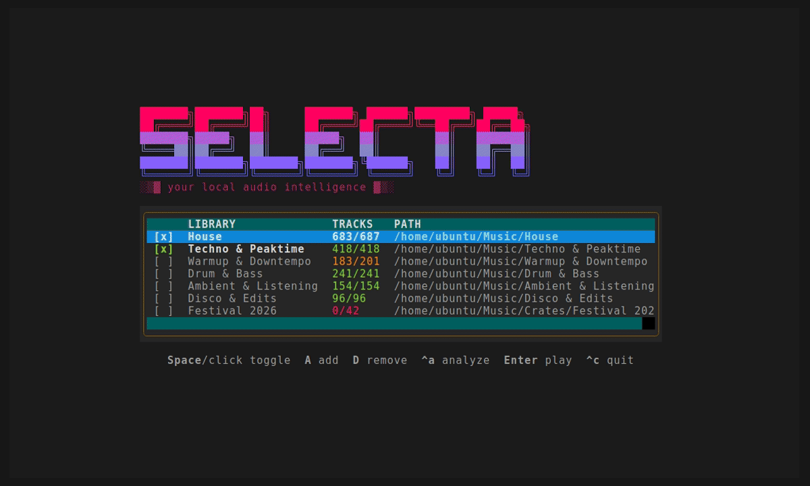
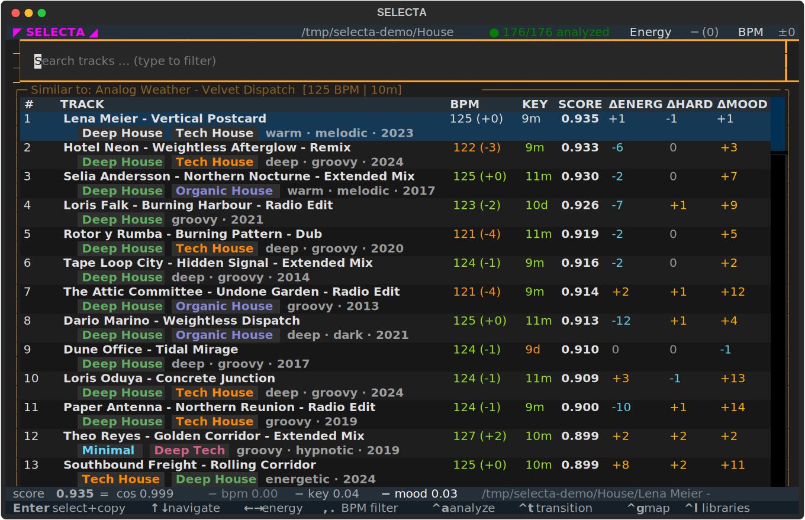
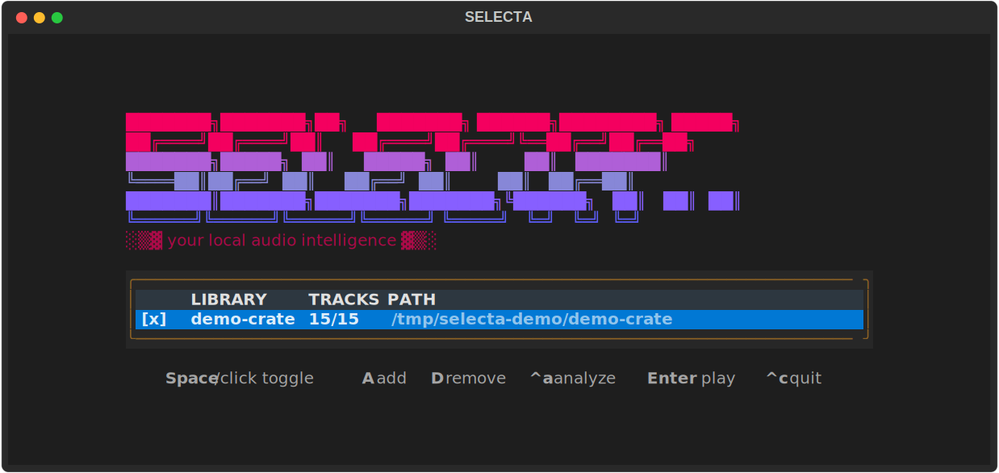
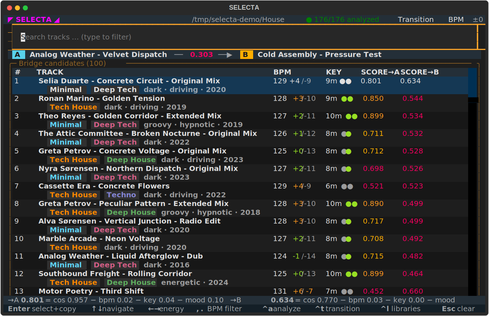

# ◤ SELECTA ◢

A terminal tool for set preparation and live DJing: finds the right next track while you play, or helps you build a selection ahead of time. One track as the query, your own library as the answer — ranked by audio embeddings computed straight from the signal, re-ranked by BPM, key and mood. Deliberately stateless, a tool that runs alongside Rekordbox & co. and answers the two questions they leave open — *what fits this track?* and *how do I get smoothly from track A to track B?*





- **Your music, wherever it came from.** SELECTA listens to the audio
  signal, not to catalog metadata. Bandcamp purchases, rips, your own
  unreleased tracks - all treated equally.
- **Local & offline.** Analysis and search run on your own machine, no
  cloud, no account.
- **SOTA models, lightweight.** Embeddings contrastively trained on track
  similarity
  ([`discogs_track_embeddings`](https://essentia.upf.edu/models.html),
  Essentia / MTG-UPF).
- **Transparent, not a black box.** Every score is traceable (embedding
  cosine, BPM distance, harmonic distance, mood deltas), and every knob
  lives in `selecta/config.py` for you to fine-tune.
- **Genre & vibe tags, straight from the signal.** 400 Discogs sub-genre
  styles (Acid House, Deep Techno, …) and DJ-relevant vibe tags (dark,
  deep, uplifting, …) are computed per track and shown as a chip line
  under each result — plus the release year, if your files carry a tag.
- **Multiple libraries, one search.** Register your music folders once in
  the launcher, toggle any combination active, and search across all of
  them. Each folder keeps its own analysis CSV and stays portable.

## Requirements

Python 3.14 (exactly this version — `essentia-tensorflow` is only pinned
as a Python 3.14 wheel). `essentia-tensorflow` is only available as a
Linux wheel — so SELECTA does not run on macOS, and runs on Windows via
WSL2 (see below).

## Setup (Linux / WSL)

```bash
cd ~/selecta
python3 -m venv .venv
source .venv/bin/activate
pip install -e .
```

## Setup (Windows via WSL2)

Install WSL2 with Ubuntu once (`wsl --install -d Ubuntu`, current LTS —
do **not** pin an older version number; those ship Python 3.10/3.12
instead of the required 3.14).
Then copy this folder anywhere (e.g. via USB stick) and double-click
`Selecta.bat` — on first launch it automatically sets up the venv and
dependencies inside WSL (`setup.sh`) and then starts the TUI. You can
also drag a folder onto `Selecta.bat` to pass it as the music folder.

## Running

```bash
selecta                             # TUI, opens the library launcher
selecta /path/to/your/music         # TUI, single folder ad-hoc (saved list untouched)
selecta analyze --music-dir DIR     # headless analysis (e.g. overnight)
```

### Libraries



Started without arguments, SELECTA opens the **library launcher**: your
music folders as a list, each with an active toggle. Add a folder once —
drag & drop it from your file manager into the terminal window, the path
is pasted for you — and SELECTA remembers it in
`~/.local/share/selecta/libraries.json`. **Enter** starts the search
across *all active* libraries at once; each folder keeps its own
`library_analysis.csv`, so folders stay portable and analyses resumable.
Nested folders are deduplicated in the search.

| Launcher key | Function |
|---|---|
| `Space` / click | Toggle a library active/inactive |
| `A` | Add a library (drag & drop the folder, or paste a path) |
| `D` | Remove the entry (the CSV inside the folder is kept) |
| `Ctrl+A` | Analyze the highlighted library |
| `Enter` | Start the search across all active libraries |

`Ctrl+L` brings the launcher back mid-session to switch libraries — the
current query and energy setting survive if the query track is still in
the new selection.

Analysis results are stored as `library_analysis.csv` inside the music
folder (resumable; existing CSVs are automatically backfilled with
embeddings). Models are downloaded once into `./models` (~48 MB).

CSVs written by older SELECTA versions (before genre/vibe tagging) are
picked up automatically: the next analysis run (`Ctrl+A`) re-analyzes
those rows once and fills in the new columns.

## Usage

Typing filters the library, **Enter** takes the highlighted track as the
query — the list then shows the most similar tracks. **Enter/click on a
result** makes it the new query (that's how you walk through a set).

| Key | Function |
|---|---|
| `↑` `↓` | Navigate the list (detail line at the bottom shows the highlighted track) |
| `←` `→` | Energy axis −6…+6: shifts the search target (BPM/arousal/hardness) |
| `,` `.` | BPM filter: hard cutoff (only faster or slower tracks), each press snaps to the next BPM value present in the library |
| `Ctrl+A` | Analyze all active libraries in sequence (confirmation → progress + live per-track log: analysis stages while running, then genre/vibe tags and scores per finished track) |
| `Ctrl+T` | Pin a transition target (fuzzy search + Enter): the list shows bridge tracks between the current query and the target |
| `Ctrl+L` | Back to the library launcher (switch libraries mid-session) |
| `Esc` | Clear the search / go back |
| `Ctrl+C` / `Ctrl+Q` | Quit |

Letters always type into the search. `←→,.` only act when the search
field is **empty** — with text in the field they move the cursor or type
as usual.

### Result columns

| Column | Meaning | Source | Colors |
|---|---|---|---|
| **BPM** | Tempo, with Δ to the query in parentheses | ID3 tag (Rekordbox/Traktor); computed from the signal if untagged | green = directly mixable (≤2 % apart, half/double tempo aware), yellow ≤6 % |
| **KEY** | Musical key, Open Key (`7m`) or Camelot (`8A`) notation | ID3 tag from your DJ software; estimated from the signal if untagged (shown dimmed as `~9m`) | green = harmonically compatible with the query (same, relative or neighbouring key), yellow = workable |
| **SCORE** | Overall similarity: embedding cosine minus BPM/key/mood penalties | computed | bold; in transition mode ≥0.9 green, ≥0.8 yellow, ≥0.7 orange, red below |
| **ΔENERG** | Energy difference (arousal) as Δ×10 (+4 = +0.4) | model head, from the signal | orange = candidate is more energetic, cyan = calmer |
| **ΔHARD** | Hardness difference (aggressiveness) as Δ×10 | model head, from the signal | orange = harder, cyan = softer |
| **ΔMOOD** | Mood difference (valence) as Δ×10 | model head, from the signal | orange = brighter, cyan = darker |

All Δ columns are relative to the current query track. Every weight and
threshold behind these columns lives in `selecta/config.py`.

Below each track a chip line shows its sub-genre tags (colored pills),
vibe tags and year (dimmed) — rows without tags stay single-line. Tags
are display-only; the ranking is not affected (genre similarity is
already captured by the embedding cosine).

### What gets computed per track, and by what

Everything lands in the folder's `library_analysis.csv`. Tags written by
your DJ software always win over SELECTA's own estimates — the estimate
is a placeholder until better data arrives.

| Data | Source / technology |
|---|---|
| Artist, title, year | ID3 tags, read with [mutagen](https://mutagen.readthedocs.io); filename as title fallback |
| BPM | DJ-software tag if present; otherwise computed with Essentia's [RhythmExtractor2013](https://essentia.upf.edu/reference/std_RhythmExtractor2013.html) (≈0.1 BPM mean error vs. Rekordbox references) |
| Key | DJ-software tag if present; otherwise estimated with Essentia's [KeyExtractor](https://essentia.upf.edu/reference/std_KeyExtractor.html) using the `edmm` profile from [Faraldo et al., *Key Estimation in Electronic Dance Music*](https://www.researchgate.net/publication/309018542_Key_Estimation_in_Electronic_Dance_Music) (~75 % exact on tagged references). Estimates are shown dimmed with a `~` prefix and are overwritten as soon as a DJ tag appears |
| Similarity embedding | 512-dim vector from [`discogs_track_embeddings`](https://essentia.upf.edu/models.html#discogs-effnet) — a Discogs-EffNet trained contrastively on track similarity (Essentia models, MTG-UPF). The ranking is the cosine similarity of these vectors |
| Genre chips | [`genre_discogs400`](https://essentia.upf.edu/models.html#genre-discogs400) classification head — 400 Discogs sub-genre styles on the EffNet embedding |
| Vibe chips | [`mtg_jamendo_moodtheme`](https://essentia.upf.edu/models.html#mtg-jamendo-mood-and-theme) head — 56 mood/theme tags, filtered to a DJ-relevant subset |
| Arousal & valence (ΔENERG, ΔMOOD) | [DEAM](https://essentia.upf.edu/models.html#arousal-valence-deam) regression head on a [MusiCNN](https://essentia.upf.edu/models.html#msd-musicnn) embedding |
| Mood scores (ΔHARD, penalties, detail line) | Essentia [classification heads](https://essentia.upf.edu/models.html#classification-heads) on the EffNet embedding: aggressive, happy, sad, relaxed, party, danceability, approachability, engagement |

All models run locally (downloaded once, ~48 MB); every weight and
threshold lives in `selecta/config.py`.



**Transition mode** (`Ctrl+T`): pin a target track B, and the list shows
bridge candidates with SCORE→A and SCORE→B (≥0.9 green, ≥0.8 yellow,
≥0.7 orange, red below), sorted by the weaker side — the bottleneck
decides whether a bridge works. BPM and key are shown to *both* sides at
once without doubling the table: the BPM cell reads `129 +2/−4` (delta to
A, then to B) and the key cell reads `7m ●●` (one dot per side, same
green/yellow/dim compatibility colors as elsewhere); the full score
breakdown for both sides (`→A … →B …`) is in the detail line at the
bottom as you move the cursor. Typing still searches the whole library —
pinning a target doesn't lock you out of finding a specific candidate by
name, the search just gains the same SCORE→A/→B columns. A **transition
bar** above the list always shows where you are: query A on the left,
target B on the right, and the direct A→B score in between — the gap you
are bridging. B itself is ranked along with the rest (marked `◆B` in the
list) and rises to the top once the direct jump is the best option.
**Enter** on a candidate makes it the new query (B stays pinned, the bar
follows — that's how you work your way from a slow opener to a hard
closer), **Enter on B**, **Esc** or pressing `Ctrl+T` again ends the
mode. The BPM filter (`,` `.`) stays active; the energy axis is disabled
in transition mode.

Tracks you've already used as a query this session are marked with a
dimmed `✓` in front of their rank number and a dimmed label — a quick way
to see what you've already played without losing it from the list (it's
still a valid pick, and never penalized in the ranking). This is
per-session only, nothing is written to disk.

## Development

```bash
pip install -e ".[dev]"
pytest
```

Tuning constants (energy step sizes, weights, top-N): `selecta/config.py`.

The README screenshots are generated, not recorded: `scripts/demo_library.py`
builds a folder of fictional tracks with hand-crafted embedding clusters
(the TUI loads purely from the CSV, no audio needed), and
`python scripts/make_screens.py` drives the real app headless and exports
the SVGs to `docs/`. Rerun it after UI changes. `scripts/demo.tape` is the
matching [VHS](https://github.com/charmbracelet/vhs) script for an animated
GIF of the same flow.

`selecta map --music-dir DIR [--music-dir DIR2 ...] [--out FILE] [--no-open]`
is an experimental, CLI-only command: it projects every analyzed track's
embedding to 2D (PCA by default, or `pip install -e ".[map]"` for a
PaCMAP/UMAP layout) and writes a self-contained dark HTML page you can open
in a browser. Not wired into the TUI yet — it needs search/filter and a
proper legend before it earns a keybinding.

## Dependencies & license

Uses [Essentia](https://essentia.upf.edu) (`essentia-tensorflow`),
distributed by the Music Technology Group (UPF) under AGPLv3
(non-commercial) or a commercial license — see the
[licensing information](https://essentia.upf.edu/licensing_information.html)
if you want to use this project commercially.
